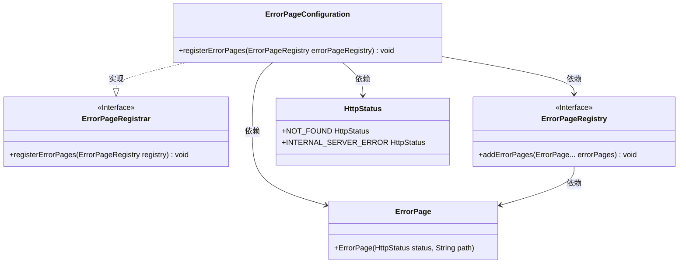
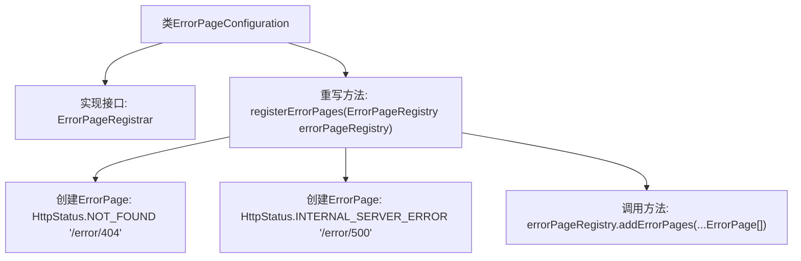

# 基础信息

|      |      |
|------|------|
| 名称 | ErrorPageConfiguration |
| 编码语言 | .java |
| 代码路径 | weixin-java-miniapp-demo/src/main/java/com/github/binarywang/demo/wx/miniapp/error/ErrorPageConfiguration.java |
| 包名 | com.github.binarywang.demo.wx.miniapp.error |
| 依赖项 | ['org.springframework.boot.web.server.ErrorPage', 'org.springframework.boot.web.server.ErrorPageRegistrar', 'org.springframework.boot.web.server.ErrorPageRegistry', 'org.springframework.http.HttpStatus', 'org.springframework.stereotype.Component'] |
| 概述说明 | 该配置类实现了错误页面注册功能，当发生404或500错误时，将分别跳转到/error/404和/error/500页面。 |

# 说明

这是一个Spring Boot应用的错误页面配置类，实现了ErrorPageRegistrar接口。该组件通过重写registerErrorPages方法，向错误页面注册器添加了两个自定义错误页面映射：将HTTP 404状态码映射到/error/404路径，将HTTP 500状态码映射到/error/500路径。当应用发生相应错误时，会自动跳转到指定的错误处理页面，实现统一的错误页面管理功能。

# 类列表 Class Summary

| 名称   | 类型  | 说明 |
|-------|------|-------------|
| ErrorPageConfiguration | class | 该配置类实现了错误页面注册功能，当发生404或500错误时，将分别跳转到/error/404和/error/500页面。 |

## 类 ErrorPageConfiguration

|      |      |
|------|------|
| 访问范围 | @Component;public |
| 类型 | class |
| 名称 | ErrorPageConfiguration |
| 说明 | 该配置类实现了错误页面注册功能，当发生404或500错误时，将分别跳转到/error/404和/error/500页面。 |

### UML类图

该类图展示了一个用于配置错误页面的组件 `ErrorPageConfiguration`，它实现了 `ErrorPageRegistrar` 接口，并在注册错误页面时依赖 `ErrorPageRegistry`、`ErrorPage` 和 `HttpStatus` 类。其中，`ErrorPage` 用于定义特定状态码对应的跳转路径，整个结构清晰表达了错误处理机制中的类与接口之间的关系。

### 内部方法调用关系图

该流程图展示了`ErrorPageConfiguration`类如何实现`ErrorPageRegistrar`接口，并通过`registerErrorPages`方法注册自定义的404和500错误页面。流程包括实例化两个`ErrorPage`对象并将其添加到`errorPageRegistry`中，从而完成错误页面配置。

### 字段列表 Field List

| 名称  | 类型  | 说明 |
|-------|-------|------|

### 方法列表

| 名称  | 类型  | 说明 |
|-------|-------|------|
| registerErrorPages | void | 该代码片段展示了如何在Spring Boot应用中注册自定义错误页面。通过实现ErrorPageRegistry接口，将HTTP 404和500错误分别映射到/error/404和/error/500路径，实现统一的错误处理机制。 |

