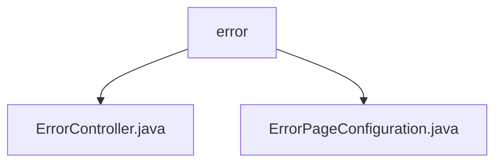

# 基础信息

|      |      |
|------|------|
| 名称 | error |
| 编码语言 | .java |
| 代码路径 | weixin-java-miniapp-demo/src/main/java/com/github/binarywang/demo/wx/miniapp/error |
| 包名 | docs.src.main.java.com.github.binarywang.demo.wx.miniapp.error |
| 概述说明 | 这是一个Spring Boot错误处理系统，包含错误控制器和配置类。控制器通过@RequestMapping("/error")统一处理404和500错误，返回error视图页面。配置类实现ErrorPageRegistrar接口，将404和500状态码分别映射到/error/404和/error/500路径，实现统一错误页面管理和跳转功能。 |

# 说明

## 概述  
该模块负责Spring Boot应用中全局错误处理与页面跳转的统一管理，通过ErrorController和ErrorPageConfiguration协同实现异常捕获与视图渲染。其核心职责是拦截404和500等常见HTTP错误，并引导至统一错误页面展示，提升用户体验与系统健壮性。

接口规范方面，ErrorController暴露了/error路径下的GET请求处理器，分别响应404和500状态码；而ErrorPageConfiguration则通过实现ErrorPageRegistrar接口，在WebServer启动时注册状态码到路径的映射关系。

关键数据结构包括HttpStatus（表示HTTP状态码）、ModelAndView（封装视图信息）以及ErrorPage（用于注册错误跳转规则）。两者配合完成从错误识别到页面展示的闭环流程。

外部依赖主要包括Spring Boot Web模块中的@Controller、@RequestMapping、ErrorPageRegistrar及相关HTTP注解，未引入其他第三方库。

例如，当用户访问不存在的URL时，系统将触发404错误并跳转至/error/404，最终由ErrorController返回error视图页面。

## 主要业务场景  
本模块覆盖两类主要业务流程：一是运行期异常捕获及页面反馈，二是服务启动阶段错误路由配置。两者结合形成完整的错误响应机制，确保前后端交互稳定性。

在交互模式上，采用类似事件总线模式的设计思想——即通过统一入口接收各类错误信号，并分发给对应的处理逻辑进行页面渲染或重定向操作。

功能完整性体现在既支持静态错误页配置也兼容动态控制器处理方式，从而满足不同层级的错误响应需求。此外还预留扩展能力以适配更多状态码类型。

典型应用场景包括Web页面找不到（404）、服务器内部出错（500）等情况下的友好提示界面展示。同时也适用于小程序后端接口调试过程中对非预期状态的统一管控。

API类型集中于Spring MVC风格的RESTful接口设计，集成案例可见于微信小程序Demo项目中关于基础错误兜底策略的实际部署。

### 包内部结构视图

该流程图展示了微信小程序Java Demo项目中错误处理模块的结构，`error` 文件夹作为父节点，包含了两个子文件：`ErrorController.java` 和 `ErrorPageConfiguration.java`，用于处理错误页面逻辑与配置。

# 文件列表

| 名称   | 类型  | 说明 |
|-------|------|-------------|
| [ErrorController.java](ErrorController.md) | file | 这是一个Spring Boot错误处理控制器，映射/error路径下的404和500错误请求，统一返回error视图页面。 |
| [ErrorPageConfiguration.java](ErrorPageConfiguration.md) | file | 该配置类实现了错误页面注册功能，当出现404或500错误时，将分别跳转到/error/404和/error/500页面。 |

