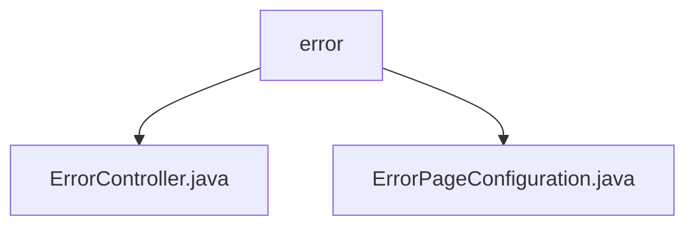

# 基础信息

|      |      |
|------|------|
| 名称 | error |
| 编码语言 | .java |
| 代码路径 | weixin-java-miniapp-demo/src/main/java/com/github/binarywang/demo/wx/miniapp/error |
| 包名 | docs.src.main.java.com.github.binarywang.demo.wx.miniapp.error |
| 概述说明 | Spring MVC错误处理控制器，映射/error路径，包含404和500错误处理方法。配置类实现ErrorPageRegistrar接口，注册404和500错误页面路径。 |

# 说明

## 概述  
该模块核心职责是统一处理HTTP错误页面响应，包含错误请求路由和错误页面注册配置。接口规范遵循Spring MVC标准，通过@Controller和@RequestMapping实现路径映射，ErrorPageRegistrar接口实现错误状态码与路径的绑定。关键数据结构包括ErrorPage对象和ErrorPageRegistry注册器。外部依赖仅Spring Web框架。例如ErrorController处理/error/404请求，ErrorPageConfiguration注册404状态码跳转路径。

## 主要业务场景  
模块通过协同工作的两个组件完成错误处理：控制器接收具体错误请求，配置类建立状态码与路径的映射关系。交互模式类似路由中转站，错误状态码自动导向预设路径。典型应用包括用户访问不存在资源触发404跳转，或服务异常时返回500错误页。例如访问无效URL时，系统自动通过/error/404返回统一错误视图。

### 包内部结构视图

该流程图展示了微信小程序demo项目中错误处理模块的层级结构。根节点为error目录，包含两个子节点：ErrorController.java和ErrorPageConfiguration.java，分别对应错误控制器和错误页面配置类。整个结构简洁明了，体现了错误处理模块的核心文件组织方式。

# 文件列表

| 名称   | 类型  | 说明 |
|-------|------|-------------|
| [ErrorController.java](ErrorController.md) | file | 错误控制器类，处理404和500错误，返回错误页面。 |
| [ErrorPageConfiguration.java](ErrorPageConfiguration.md) | file | 错误页配置类，注册404和500错误对应的处理路径。 |

