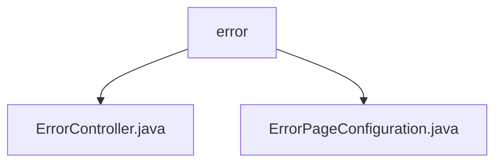

# 基础信息

|      |      |
|------|------|
| 名称 | error |
| 编码语言 | .java |
| 代码路径 | weixin-java-miniapp-demo/src/main/java/com/github/binarywang/demo/wx/miniapp/error |
| 包名 | docs.src.main.java.com.github.binarywang.demo.wx.miniapp.error |
| 概述说明 | 这是一个Spring Boot错误处理系统，包含错误控制器和配置类。控制器处理404和500错误请求，统一返回error视图；配置类注册自定义错误页面，实现优雅的错误提示机制。 |

# 说明

## 概述  
该模块负责统一处理Spring Boot应用中的常见HTTP错误（如404、500），通过配置错误页面与控制器实现一致的错误展示机制。类似事件总线模式，集中管理异常路由与响应视图。

接口规范包括/error路径下的GET请求映射方法error404和error500，均返回视图名称error；同时提供ErrorPageConfiguration类注册对应错误路径，实现错误跳转逻辑。

关键数据结构为ErrorController中的error视图模型以及ErrorPageConfiguration中对ErrorPage的注册列表。

外部依赖项包括Spring Boot框架核心组件（spring-boot-starter-web）及内置的ErrorPageRegistrar接口支持。

例如：访问不存在资源时自动跳转至/error/404并渲染error页面。

## 主要业务场景  
用户访问非法地址或服务端发生异常时触发错误处理流程，系统根据状态码定向至指定错误页路径，并由ErrorController统一渲染反馈界面。

交互模式采用标准MVC结构，前端请求经DispatcherServlet分发后匹配错误路由，调用相应Controller方法呈现结果。

功能上确保了错误提示的一致性和可维护性，提升用户体验。例如：服务器内部错误直接显示/error/500内容而非默认堆栈信息。

典型应用场景涵盖Web API异常捕获、静态资源缺失反馈等，适用于各类基于Spring Boot构建的服务平台。

API类型主要面向浏览器客户端，集成案例可见于全局异常处理机制与自定义ErrorViewResolver扩展点结合使用的情形。

### 包内部结构视图

该流程图展示了微信小程序 Demo 项目中错误处理模块的结构，`error` 包含两个 Java 文件：`ErrorController.java` 和 `ErrorPageConfiguration.java`，用于处理错误页面逻辑与配置。

# 文件列表

| 名称   | 类型  | 说明 |
|-------|------|-------------|
| [ErrorController.java](ErrorController.md) | file | 这是一个Spring Boot错误处理控制器，映射/error路径下的404和500错误页面请求，统一返回error视图。 |
| [ErrorPageConfiguration.java](ErrorPageConfiguration.md) | file | 该配置类实现了错误页面注册功能，当出现404或500错误时，分别跳转到/error/404和/error/500页面进行处理。 |

