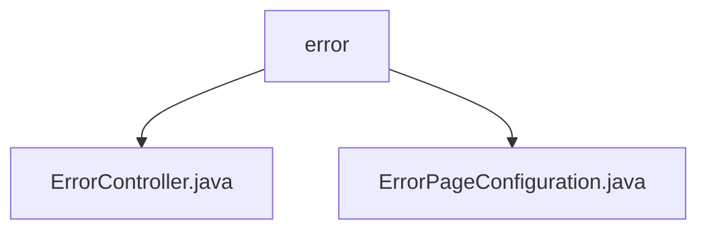

# 基础信息

|      |      |
|------|------|
| 名称 | error |
| 编码语言 | .java |
| 代码路径 | weixin-java-miniapp-demo/src/main/java/com/github/binarywang/demo/wx/miniapp/error |
| 包名 | docs.src.main.java.com.github.binarywang.demo.wx.miniapp.error |
| 概述说明 | 这是一个Spring Boot错误处理系统，包含错误控制器和配置类。控制器处理404和500错误请求，统一返回error视图。配置类实现ErrorPageRegistrar接口，将HTTP 404和500状态码映射到对应错误路径，实现统一错误页面管理。 |

# 说明

## 概述  
该模块负责统一处理Spring Boot应用中的HTTP错误页面跳转与展示，通过配置类注册自定义错误路径，并由控制器类渲染通用错误视图。接口规范上，ErrorPageConfiguration实现ErrorPageRegistrar接口完成状态码到路径的映射，ErrorController则提供对应路径下的视图响应。关键数据结构包括HttpStatus、ErrorPageRegistry和ModelAndView等。外部依赖为Spring Boot Web模块。例如：404错误被映射至/error/404并由error()方法处理。

## 主要业务场景  
模块整合了Web应用中常见的静态错误页跳转逻辑，类似事件总线模式集中管理异常入口。用户访问不存在资源或服务内部出错时，系统依据状态码自动转发至指定错误页，提升用户体验一致性。支持API类型如GET请求处理及状态驱动路由。典型应用场景如微信小程序Demo中对非法路径或服务器故障的友好提示。例如：访问未定义接口返回“页面未找到”提示。

### 包内部结构视图

该流程图展示了微信小程序 Demo 项目中错误处理模块的结构，`error` 包下包含两个Java文件，分别是用于处理错误页面配置和控制器逻辑的类文件，体现了前后端协同开发中的异常处理机制设计。

# 文件列表

| 名称   | 类型  | 说明 |
|-------|------|-------------|
| [ErrorController.java](ErrorController.md) | file | 这是一个Spring Boot错误处理控制器，映射/error路径下的404和500错误页面请求，统一返回error视图。 |
| [ErrorPageConfiguration.java](ErrorPageConfiguration.md) | file | 该配置类实现了错误页面注册功能，当发生404或500错误时，将分别跳转到/error/404和/error/500页面。 |

