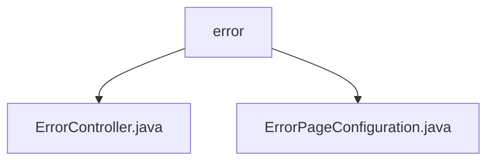

# 基础信息

|      |      |
|------|------|
| 名称 | error |
| 编码语言 | .java |
| 代码路径 | weixin-java-miniapp-demo\src\main\java\com\github\binarywang\demo\wx\miniapp\error |
| 包名 | docs.src.main.java.com.github.binarywang.demo.wx.miniapp.error |
| 概述说明 | Spring MVC控制器处理404/500错误，返回统一视图。配置类注册错误页面映射404到/error/404，500到/error/500。 |

# 说明

## 概述  
该模块核心职责是统一处理Web应用的HTTP错误响应，包含错误页面路由和配置管理。接口规范遵循Spring MVC标准，通过@Controller和@RequestMapping注解定义错误路径映射，例如/error/404和/error/500。关键数据结构包括ErrorPageRegistry和ErrorPage，用于注册状态码与路径的映射关系。外部依赖仅Spring Web框架。例如ErrorController返回统一视图模板，ErrorPageConfiguration实现错误路径跳转逻辑。

## 主要业务场景  
模块主要处理两类业务场景：用户访问不存在的资源触发404错误，或服务器异常触发500错误。交互模式类似网关路由，将状态码自动重定向到预设路径。功能完整性体现在从错误捕获到页面渲染的全流程处理。典型应用模式为Spring Boot错误处理机制扩展，例如通过ErrorPageRegistrar动态配置错误页。API类型均为服务端路由，集成案例包含404/500错误的标准处理流程。

### 包内部结构视图

该流程图展示了微信小程序demo项目中错误处理模块的层级结构。根节点为error目录，包含两个子节点：ErrorController.java和ErrorPageConfiguration.java，分别对应错误控制器和错误页面配置类。整个结构简洁明了，反映了错误处理模块的核心文件组织方式，符合典型Spring Boot项目的控制器与配置类分离的设计模式。

# 文件列表

| 名称   | 类型  | 说明 |
|-------|------|-------------|
| [ErrorController.java](ErrorController.md) | file | ErrorController处理404和500错误，返回统一错误页面。 |
| [ErrorPageConfiguration.java](ErrorPageConfiguration.md) | file | ErrorPageConfiguration类注册404和500错误页，分别映射到/error/404和/error/500路径。 |

