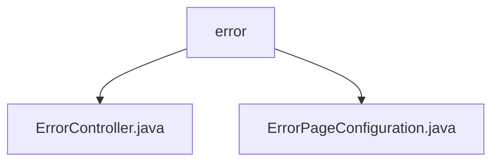

# 基础信息

|      |      |
|------|------|
| 名称 | error |
| 编码语言 | .java |
| 代码路径 | weixin-java-miniapp-demo/src/main/java/com/github/binarywang/demo/wx/miniapp/error |
| 包名 | docs.src.main.java.com.github.binarywang.demo.wx.miniapp.error |
| 概述说明 | 这是一个Spring Boot错误处理系统，包含错误控制器和配置类。控制器处理404和500错误并返回统一错误页面，配置类将HTTP状态码映射到对应错误路径实现统一管理。 |

# 说明

## 概述  
该模块负责Spring Boot应用中HTTP错误的统一处理与页面展示，通过ErrorController和ErrorPageConfiguration协同实现404和500等常见错误状态的路由映射与视图渲染。其核心机制类似事件总线模式，将不同错误状态集中分发至统一入口处理。

接口规范上，ErrorController提供/error/404和/error/500两个GET请求路径用于响应客户端访问；ErrorPageConfiguration则在服务启动时注册对应HTTP状态码到上述路径的映射关系。关键数据结构包括ErrorPage对象及HttpStatus枚举值（如404、500）。

外部依赖主要包括Spring Boot Web模块中的ErrorPageRegistrar接口及相关注解支持。例如：@Controller、@RequestMapping、HttpStatus类等均来自org.springframework包。

## 主要业务场景  
用户访问不存在资源或服务器异常时触发错误流程，系统依据状态码自动跳转至/error下的特定处理方法，并最终呈现名为error的Thymeleaf模板页。整个过程对前端透明且具备良好的扩展性，适用于各类Web应用场景下的容错控制。

API类型主要为Spring MVC风格的REST端点配合内置错误页面机制完成集成。典型应用模式是开发者可复用此结构快速构建自定义错误提示界面，而无需额外配置全局异常处理器。例如，在微信小程序后端Demo项目中直接沿用该结构以提升用户体验一致性。

### 包内部结构视图

该流程图展示了微信小程序 Demo 项目中错误处理模块的结构，`error` 包下包含两个 Java 类文件，分别用于错误控制器和错误页面配置。整体结构清晰，体现了对异常处理的分离关注点设计。

# 文件列表

| 名称   | 类型  | 说明 |
|-------|------|-------------|
| [ErrorController.java](ErrorController.md) | file | 这是一个Spring Boot错误控制器，处理404和500错误页面请求，统一返回error视图。 |
| [ErrorPageConfiguration.java](ErrorPageConfiguration.md) | file | 该配置类实现了错误页面注册功能，当出现404或500错误时，将分别跳转到/error/404和/error/500页面。 |

