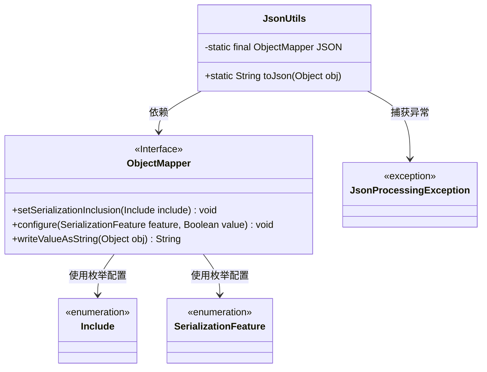
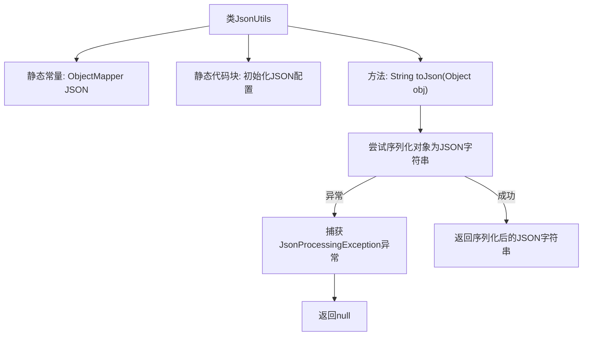

# 基础信息

|      |      |
|------|------|
| 名称 | JsonUtils |
| 编码语言 | .java |
| 代码路径 | weixin-java-miniapp-demo/src/main/java/com/github/binarywang/demo/wx/miniapp/utils/JsonUtils.java |
| 包名 | com.github.binarywang.demo.wx.miniapp.utils |
| 依赖项 | ['com.fasterxml.jackson.annotation.JsonInclude.Include', 'com.fasterxml.jackson.core.JsonProcessingException', 'com.fasterxml.jackson.databind.ObjectMapper', 'com.fasterxml.jackson.databind.SerializationFeature'] |
| 概述说明 | JsonUtils工具类提供JSON序列化功能，使用ObjectMapper实现对象转JSON字符串，配置了非空字段序列化和格式化输出，异常时打印堆栈并返回null。 |

# 说明

这是一个名为JsonUtils的Java工具类，内部使用Jackson库的ObjectMapper对象来处理JSON序列化操作。该类通过静态代码块初始化ObjectMapper实例，配置了两个重要属性：一是设置序列化时忽略空值字段，二是开启输出格式化缩进功能使JSON字符串更易读。toJson方法提供将任意Java对象转换为格式化的JSON字符串的功能，如果转换过程中出现异常则打印堆栈信息并返回null。

# 类列表 Class Summary

| 名称   | 类型  | 说明 |
|-------|------|-------------|
| JsonUtils | class | JsonUtils工具类提供JSON序列化功能，使用ObjectMapper实现对象转JSON字符串，忽略空值并格式化输出，异常时返回null。 |

## 类 JsonUtils

|      |      |
|------|------|
| 访问范围 | public |
| 类型 | class |
| 名称 | JsonUtils |
| 说明 | JsonUtils工具类提供JSON序列化功能，使用ObjectMapper实现对象转JSON字符串，忽略空值并格式化输出，异常时返回null。 |

### UML类图

该类图展示了`JsonUtils`工具类的结构及其相关依赖。其中`JsonUtils`持有静态`ObjectMapper`实例，并在静态初始化块中进行配置。其公共方法`toJson`将对象序列化为JSON字符串，若处理失败则捕获并打印异常。整体体现了Jackson库的核心使用方式及异常处理机制。

### 内部方法调用关系图

该流程图展示了`JsonUtils`类的结构与`toJson`方法的执行逻辑。首先初始化ObjectMapper并配置其属性，然后通过`toJson`方法将传入对象序列化为JSON字符串，若发生异常则打印堆栈并返回null。

### 字段列表 Field List

| 名称  | 类型  | 说明 |
|-------|-------|------|
| JSON = new ObjectMapper() | ObjectMapper | 定义了一个静态不可变的ObjectMapper实例用于JSON序列化和反序列化操作。 |

### 方法列表

| 名称  | 类型  | 说明 |
|-------|-------|------|
| toJson | String | 该方法将对象转换为JSON字符串，若转换失败则打印异常并返回null。 |

