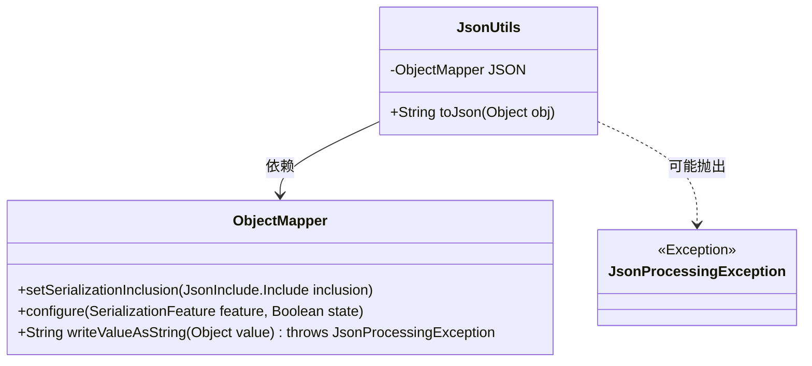
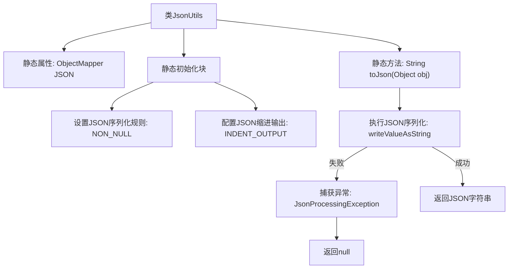

# 基础信息

|      |      |
|------|------|
| 名称 | JsonUtils |
| 编码语言 | .java |
| 代码路径 | weixin-java-miniapp-demo/src/main/java/com/github/binarywang/demo/wx/miniapp/utils/JsonUtils.java |
| 包名 | com.github.binarywang.demo.wx.miniapp.utils |
| 依赖项 | ['com.fasterxml.jackson.annotation.JsonInclude.Include', 'com.fasterxml.jackson.core.JsonProcessingException', 'com.fasterxml.jackson.databind.ObjectMapper', 'com.fasterxml.jackson.databind.SerializationFeature'] |
| 概述说明 | JsonUtils类提供静态JSON序列化方法，使用ObjectMapper配置非空字段输出和格式化，异常时返回null。 |

# 说明

JsonUtils是一个工具类，用于处理JSON序列化操作。它使用静态的ObjectMapper实例JSON，并在静态初始化块中配置了序列化行为：忽略空值字段并启用输出缩进格式。类中提供了toJson方法，可将任意对象转换为格式化的JSON字符串。若转换过程中发生JsonProcessingException异常，会打印堆栈信息并返回null。整个类设计简洁，专注于JSON序列化功能。

# 类列表 Class Summary

| 名称   | 类型  | 说明 |
|-------|------|-------------|
| JsonUtils | class | JsonUtils类提供静态方法toJson，使用ObjectMapper将对象转为JSON字符串，自动忽略null值并格式化输出。 |

## 类 JsonUtils

|      |      |
|------|------|
| 访问范围 | public |
| 类型 | class |
| 名称 | JsonUtils |
| 说明 | JsonUtils类提供静态方法toJson，使用ObjectMapper将对象转为JSON字符串，自动忽略null值并格式化输出。 |

### UML类图

这段代码展示了一个JSON工具类JsonUtils，它使用ObjectMapper进行对象与JSON字符串之间的转换。类图中包含三个主要部分：JsonUtils作为工具类封装了核心的toJson方法；ObjectMapper提供实际的JSON序列化功能，并配置了非空值输出和缩进格式化；JsonProcessingException是可能抛出的异常类型。该设计体现了单一职责原则，将JSON处理逻辑集中管理，同时通过静态初始化块确保ObjectMapper的默认配置。

### 内部方法调用关系图

这段代码展示了一个JSON工具类，核心功能是通过静态ObjectMapper实现对象到JSON字符串的序列化。流程图清晰呈现了类结构初始化过程（设置非空序列化和缩进格式）和主要方法toJson的执行逻辑（包含正常返回和异常处理路径）。静态初始化块在类加载时自动执行配置，而toJson方法封装了安全的序列化操作，异常时返回null并打印堆栈。

### 字段列表 Field List

| 名称  | 类型  | 说明 |
|-------|-------|------|
| JSON = new ObjectMapper() | ObjectMapper | 创建静态不可变的JSON对象映射器实例。 |

### 方法列表

| 名称  | 类型  | 说明 |
|-------|-------|------|
| toJson | String | 将对象转为JSON字符串，异常时返回null。 |

