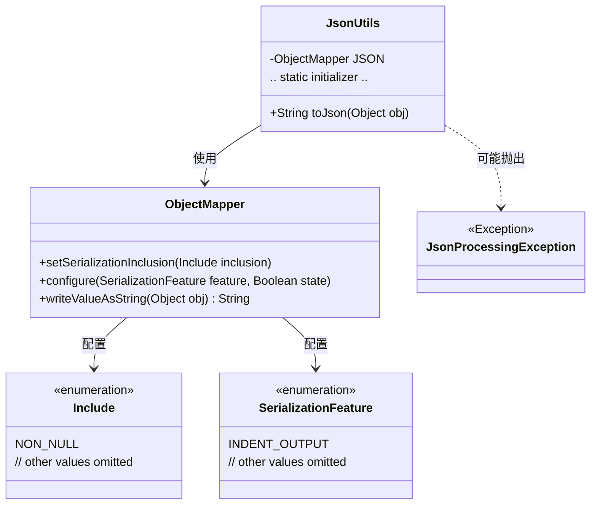
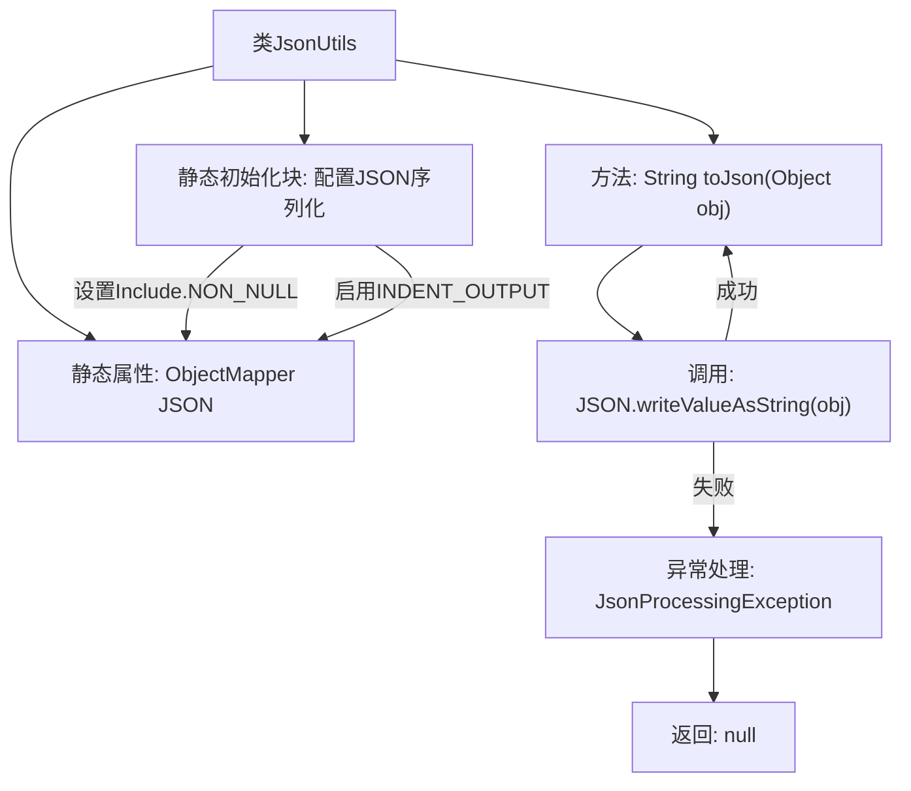

# 基础信息

|      |      |
|------|------|
| 名称 | JsonUtils |
| 编码语言 | .java |
| 代码路径 | weixin-java-miniapp-demo\src\main\java\com\github\binarywang\demo\wx\miniapp\utils\JsonUtils.java |
| 包名 | com.github.binarywang.demo.wx.miniapp.utils |
| 依赖项 | ['com.fasterxml.jackson.annotation.JsonInclude.Include', 'com.fasterxml.jackson.core.JsonProcessingException', 'com.fasterxml.jackson.databind.ObjectMapper', 'com.fasterxml.jackson.databind.SerializationFeature'] |
| 概述说明 | JsonUtils类提供静态方法toJson，使用ObjectMapper将对象转为JSON字符串，自动忽略null值并格式化输出。异常时返回null。 |

# 说明

JsonUtils是一个工具类，用于处理JSON序列化操作。它使用ObjectMapper作为核心组件，并在静态初始化块中配置了两个关键选项：忽略空值字段和启用缩进格式化输出。该类提供了一个静态方法toJson，接收任意对象作为参数，将其转换为格式化的JSON字符串。若转换过程中发生JsonProcessingException异常，会打印异常堆栈并返回null。整个类设计为简洁实用的JSON序列化工具。

# 类列表 Class Summary

| 名称   | 类型  | 说明 |
|-------|------|-------------|
| JsonUtils | class | JsonUtils工具类使用ObjectMapper实现对象转JSON字符串，配置忽略null值并格式化输出，异常时返回null。 |

## 类 JsonUtils

|      |      |
|------|------|
| 访问范围 | public |
| 类型 | class |
| 名称 | JsonUtils |
| 说明 | JsonUtils工具类使用ObjectMapper实现对象转JSON字符串，配置忽略null值并格式化输出，异常时返回null。 |

### UML类图

这段代码展示了一个JSON工具类`JsonUtils`，它使用`ObjectMapper`进行对象到JSON字符串的序列化。类图中包含核心类`JsonUtils`及其依赖的`ObjectMapper`，以及相关的配置枚举`Include`和`SerializationFeature`。`JsonUtils`通过静态初始化块配置`ObjectMapper`，提供`toJson`方法处理序列化，并可能抛出`JsonProcessingException`异常。整个设计体现了对JSON序列化的封装和异常处理机制。

### 内部方法调用关系图

这段代码展示了一个JsonUtils工具类，主要用于对象到JSON字符串的序列化。核心是通过静态初始化的ObjectMapper进行配置（忽略null值、启用缩进输出），toJson方法封装了写值操作并处理可能的JsonProcessingException异常。流程图清晰呈现了类结构、初始化配置和主方法逻辑分支，特别是异常处理路径的走向。

### 字段列表 Field List

| 名称  | 类型  | 说明 |
|-------|-------|------|
| JSON = new ObjectMapper() | ObjectMapper | 定义私有静态不可变JSON对象映射器实例。 |

### 方法列表

| 名称  | 类型  | 说明 |
|-------|-------|------|
| toJson | String | 将对象转为JSON字符串，异常时返回null。 |

