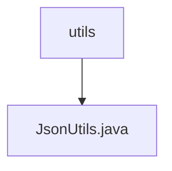

# 基础信息

|      |      |
|------|------|
| 名称 | utils |
| 编码语言 | .java |
| 代码路径 | weixin-java-miniapp-demo/src/main/java/com/github/binarywang/demo/wx/miniapp/utils |
| 包名 | docs.src.main.java.com.github.binarywang.demo.wx.miniapp.utils |
| 概述说明 | JsonUtils工具类提供JSON序列化功能，使用ObjectMapper实现对象到JSON字符串的转换，配置了非空字段序列化和格式化输出，异常时返回null并打印堆栈信息。 |

# 说明

这是一个名为JsonUtils的Java工具类，内部使用Jackson库的ObjectMapper对象来处理JSON序列化操作。该类通过静态代码块初始化ObjectMapper实例，配置了两个重要属性：一是设置序列化时忽略空值字段，二是开启格式化输出功能使JSON字符串具有良好的可读性。toJson方法提供将任意Java对象转换为JSON格式字符串的功能，转换过程中如果发生JsonProcessingException异常会打印堆栈信息并返回null。该工具类采用了单例模式思想，通过静态字段持有ObjectMapper实例以提高性能和资源利用率。

### 包内部结构视图

该流程图展示了微信小程序Java开发示例项目中的工具类结构，`utils`包作为工具类集合目录，包含了用于处理JSON数据的`JsonUtils.java`文件，体现了项目中基础功能模块的组织方式。

# 文件列表

| 名称   | 类型  | 说明 |
|-------|------|-------------|
| [JsonUtils.java](JsonUtils.md) | file | JsonUtils工具类提供JSON序列化功能，使用ObjectMapper实现对象到JSON字符串的转换，配置了非空字段序列化和格式化输出，异常时返回null并打印堆栈信息。 |

