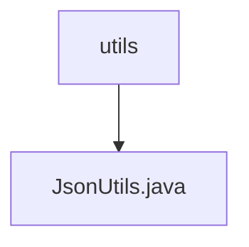

# 基础信息

|      |      |
|------|------|
| 名称 | utils |
| 编码语言 | .java |
| 代码路径 | weixin-java-miniapp-demo\src\main\java\com\github\binarywang\demo\wx\miniapp\utils |
| 包名 | docs.src.main.java.com.github.binarywang.demo.wx.miniapp.utils |
| 概述说明 | JsonUtils类提供静态方法toJson，使用ObjectMapper将对象转为JSON字符串，自动忽略null值并格式化输出。异常时返回null。 |

# 说明

JsonUtils是一个工具类，用于处理JSON序列化操作。它使用ObjectMapper作为核心组件，并在静态初始化块中配置了两个关键选项：忽略空值字段和启用缩进格式化输出。该类提供了一个静态方法toJson，接收任意对象作为参数，将其转换为格式化的JSON字符串。若转换过程中发生JsonProcessingException异常，会打印异常堆栈并返回null。整个类设计为简洁实用的JSON序列化工具。

### 包内部结构视图

该流程图展示了微信小程序demo项目中工具类目录的结构关系。顶层节点为utils工具目录，其下级仅包含一个JsonUtils.java工具类文件，用于处理JSON相关操作。这种简洁的单层结构表明这是一个功能集中的工具模块，专注于提供JSON数据处理能力。

# 文件列表

| 名称   | 类型  | 说明 |
|-------|------|-------------|
| [JsonUtils.java](JsonUtils.md) | file | JsonUtils类提供静态方法toJson，使用ObjectMapper将对象转为JSON字符串，自动忽略null值并格式化输出。异常时返回null。 |

