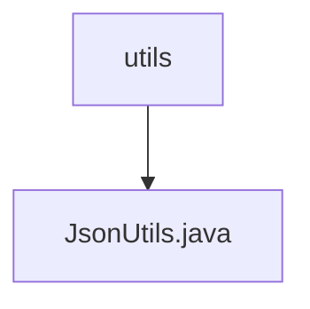

# 基础信息

|      |      |
|------|------|
| 名称 | utils |
| 编码语言 | .java |
| 代码路径 | weixin-java-miniapp-demo/src/main/java/com/github/binarywang/demo/wx/miniapp/utils |
| 包名 | docs.src.main.java.com.github.binarywang.demo.wx.miniapp.utils |
| 概述说明 | JsonUtils工具类提供JSON序列化功能，使用ObjectMapper实现对象到JSON字符串的转换，配置了非空字段序列化和格式化输出，异常时返回null并打印堆栈信息。 |

# 说明

这是一个名为JsonUtils的Java工具类，内部使用Jackson库的ObjectMapper对象来处理JSON序列化操作。该类通过静态代码块初始化了一个名为JSON的ObjectMapper实例，并配置了两个属性：设置序列化时忽略空值字段，以及启用格式化输出功能使JSON字符串具有良好的可读性。该工具类提供一个公共静态方法toJson，用于将任意Java对象转换为格式化的JSON字符串表示形式，如果转换过程中出现异常则打印堆栈跟踪信息并返回null。

### 包内部结构视图

该流程图展示了微信小程序Java开发示例项目中的工具类结构，`utils`目录下包含一个JSON处理工具文件`JsonUtils.java`，体现了项目中工具模块的组织方式。

# 文件列表

| 名称   | 类型  | 说明 |
|-------|------|-------------|
| [JsonUtils.java](JsonUtils.md) | file | JsonUtils工具类提供JSON序列化功能，使用ObjectMapper实现对象到JSON字符串的转换，配置了非空字段序列化和格式化输出，异常时返回null并打印堆栈信息。 |

