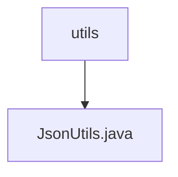

# 基础信息

|      |      |
|------|------|
| 名称 | utils |
| 编码语言 | .java |
| 代码路径 | weixin-java-miniapp-demo/src/main/java/com/github/binarywang/demo/wx/miniapp/utils |
| 包名 | docs.src.main.java.com.github.binarywang.demo.wx.miniapp.utils |
| 概述说明 | JsonUtils工具类提供JSON序列化功能，使用ObjectMapper实现对象转JSON字符串，配置了非空字段序列化和格式化输出，异常时打印堆栈并返回null。 |

# 说明

这是一个名为JsonUtils的Java工具类，内部使用Jackson库的ObjectMapper对象来处理JSON序列化操作。该类通过静态代码块初始化ObjectMapper实例，配置了两个重要属性：一是设置序列化时忽略空值字段，二是开启输出格式化缩进功能使JSON字符串更易读。toJson方法提供将任意Java对象转换为格式化的JSON字符串的功能，如果转换过程中出现异常则打印堆栈信息并返回null。

### 包内部结构视图

该流程图展示了项目 `weixin-java-miniapp-demo` 中的一个工具类目录 `utils` 及其包含的文件 `JsonUtils.java` 的层级关系。`utils` 目录作为父节点，`JsonUtils.java` 为其子文件，体现了典型的Java项目结构中工具类的组织方式。

# 文件列表

| 名称   | 类型  | 说明 |
|-------|------|-------------|
| [JsonUtils.java](JsonUtils.md) | file | JsonUtils工具类提供JSON序列化功能，使用ObjectMapper实现对象转JSON字符串，配置了非空字段序列化和格式化输出，异常时打印堆栈并返回null。 |

