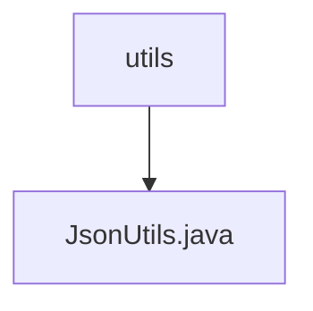

# 基础信息

|      |      |
|------|------|
| 名称 | utils |
| 编码语言 | .java |
| 代码路径 | weixin-java-miniapp-demo/src/main/java/com/github/binarywang/demo/wx/miniapp/utils |
| 包名 | docs.src.main.java.com.github.binarywang.demo.wx.miniapp.utils |
| 概述说明 | JsonUtils类提供静态JSON序列化方法，使用ObjectMapper配置非空字段输出和格式化，异常时返回null。 |

# 说明

JsonUtils是一个工具类，用于处理JSON序列化操作。它使用静态的ObjectMapper实例JSON，并在静态初始化块中配置了序列化行为：忽略空值字段并启用输出缩进格式。类中提供了toJson方法，可将任意对象转换为格式化的JSON字符串。若转换过程中发生JsonProcessingException异常，会打印堆栈信息并返回null。整个类设计简洁，专注于JSON序列化功能。

### 包内部结构视图

该流程图展示了微信小程序demo项目中工具类的层级关系。顶层节点是utils目录，它包含一个工具类文件JsonUtils.java。这是一个典型的单文件工具类结构，用于处理JSON相关操作。整个结构简洁明了，符合工具类模块的设计模式。

# 文件列表

| 名称   | 类型  | 说明 |
|-------|------|-------------|
| [JsonUtils.java](JsonUtils.md) | file | JsonUtils类提供静态JSON序列化方法，使用ObjectMapper配置非空字段输出和格式化，异常时返回null。 |

