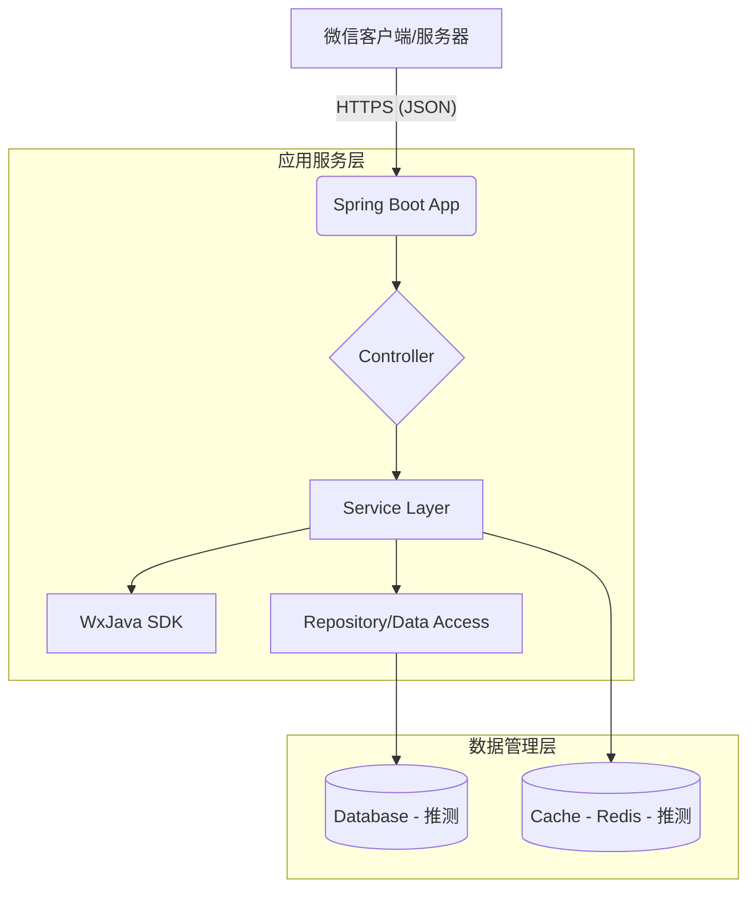

# 系统架构

## 系统概览

本节提供了对该后端项目的宏观视角，涵盖其核心业务功能、所采用的架构模式及判断依据。

* **项目核心功能与业务领域：**  
该项目是一个面向微信小程序平台的应用后端服务，主要用于处理来自微信生态的消息推送、用户身份校验、会话管理及其他相关接口交互。其主要服务于移动互联网场景下的轻量级业务系统，具备良好的集成能力和标准化对接能力。

* **架构模式：**  
该系统采用 **单体应用架构（Monolithic Architecture）**。

* **架构模式支撑依据：**  
- 所有代码均集中在一个代码仓库中，并未发现明显的微服务拆分结构（如 `services/user`, `services/order` 等目录）。
- 存在一个统一的 Spring Boot 应用程序入口点。
- 只有一个 Dockerfile 文件用于打包整个应用程序。
- 没有多个独立部署的服务定义或容器编排文件中的多服务声明。
- 使用了单一的 Java 技术栈和 Spring 生态体系完成所有业务逻辑开发。
- 配置文件（application.yml）为全局共享资源，而非按服务隔离配置。

## 核心组件与功能图谱

本节详细剖析了系统的组成单元及其在整体架构中的职责划分，包括流量入口层、应用服务层和数据管理层。

* **流量入口层 (Traffic Entry Layer)：**  
    * **组件与职责：**  
    外部流量通过标准 HTTPS 请求接入至运行于容器内的 Java Web 服务进程。由于没有明确配置反向代理（如 Nginx）或 API 网关，因此可推测当前系统直接暴露 HTTP(S) 端口接收请求。
    
    * **实现考量：**  
    在生产环境中建议引入前置网关层进行 SSL 终止、限流控制和服务路由；但在当前阶段，系统依赖客户端或基础设施层（如 Kubernetes Ingress Controller）提供此类支持。

* **应用服务层 (Application Service Layer)：**  
    * **服务清单与核心功能：**  

| 服务名称       | 主要职责                                       | 技术基座                            | 内部结构洞察                                                                 |
|----------------|------------------------------------------------|-------------------------------------|------------------------------------------------------------------------------|
| 微信小程序后端服务 | 处理来自微信服务器的消息通知、用户登录凭证验证、会话状态维护等 | Java + Spring Boot + WxJava SDK     | 项目组织上可能包含 controller 层（对外 API）、service 层（业务逻辑）、repository/domain 层（模型与持久化抽象） |

    * **技术基座说明：**  
    - **Spring Boot**: 快速搭建企业级 RESTful 接口的基础框架，适合中小型单体应用；
    - **WxJava SDK**: 是国内广泛使用的开源微信开发工具包，封装了大量与微信 API 对接所需的签名计算、加解密等功能；
    - **OpenJDK 8 Alpine**: 轻量化基础镜像，适用于容器环境下的高效部署。

    * **内部结构洞察：**  
    根据典型 Spring Boot 工程结构推断，项目可能具有如下层级：
    - `controller`: 提供对外 HTTP 接口；
    - `service`: 实现具体业务规则；
    - `config`: 定义自动装配类和第三方组件初始化；
    - `dto/model`: 数据传输对象与实体映射；
    - `utils`: 辅助方法集合。

    * **异步任务与后台处理：**  
    当前未见明确异步任务调度机制（如 ScheduledExecutor、Quartz 或 RabbitMQ/Celery 类似方案）。然而，在微信场景中可能存在需要后台执行的任务（如模板消息发送、二维码生成等），建议后续考虑引入轻量级异步任务队列以提升响应效率和用户体验。

* **数据管理层 (Data Management Layer)：**  
    * **数据存储组件识别与职责：**  
    目前尚未显式配置数据库连接参数，但考虑到实际应用场景，通常需配合使用关系型数据库保存用户信息、订单记录等内容。此外也可能涉及缓存系统加速高频读取操作。

    * **数据职责与选型考量：**  
    - 若存在本地数据持久化需求，推荐使用 MySQL 或 PostgreSQL，便于事务管理和复杂查询；
    - Redis 可作为 Session 缓存和短期状态暂存区，提高并发访问性能；
    - 如涉及跨地域部署或多实例同步问题，应设计合理的主从复制与分片策略。

## 容器配置概览

本节汇总了从 Dockerfile 和 CI/CD 配置中提取的关键容器化信息。

| 服务名称 (Service Name) | 容器镜像 (Container Image) | 暴露端口 (Exposed Ports) | 挂载卷 (Volumes) | 关键环境变量 (Key Env Vars) | 启动命令/入口点 (Startup Command/Entrypoint) |
| :---------------------- | :-------------------------- | :----------------------- | :--------------- | :-------------------------- | :------------------------------------------- |
| `weixin-miniapp-backend` | `openjdk:8-jdk-alpine`      | 默认内嵌端口（Spring Boot 默认 8080） | `/tmp`           | `N/A`                       | `["java","-Djava.security.egd=file:/dev/./urandom","-jar","/app.jar"]` |

> 注：虽然未看到 docker-compose.yml 明确声明服务暴露端口，但从常规 Spring Boot 部署习惯来看，默认监听 8080 端口，可通过 `-p` 参数手动映射宿主机端口。

## 服务间协作与数据流转

本节描绘了系统内外部之间的数据流向和交互方式。

* **核心通信路径：**  
外部微信客户端 → 微信官方服务器 → 后端服务（HTTPS POST）→ 解析并处理微信事件（如登录、支付回调）→ 返回结果给微信服务器 → 最终反馈至前端小程序界面。

* **交互模式与协议：**  
- 外部调用主要通过 HTTPS 协议承载 JSON 格式的请求体；
- 内部处理遵循 MVC 模式，由 Controller 接收请求并转发至 Service 层执行业务逻辑；
- 未发现明显的服务间远程调用行为，符合单体架构特征。

* **共享与隔离：**  
- 所有模块共享同一 JVM 上下文空间；
- 数据访问集中在统一的数据源之上，不存在服务级别数据库隔离。

## 整体架构概览图 (Mermaid 语法)

## 架构师核心洞察与未来展望

本节聚焦于当前架构的战略价值、潜在风险及长期发展方向。

* **弹性与扩展性策略：**  
目前系统属于无状态设计，易于横向扩容副本数量应对突发流量增长。但由于缺乏负载均衡器前置分流机制，短期内难以做到动态伸缩。未来若迁移到云原生平台（Kubernetes），可通过 Deployment + HPA 自动调节 Pod 数目。

* **高可用性与韧性设计：**  
当前部署形态不具备多实例容灾特性，一旦节点故障将影响全部服务能力。建议增加探针健康检查机制，并结合外部负载均衡设施实现故障漂移。

* **安全防御体系：**  
- 微信侧已内置 token/aesKey 加签验签机制防止伪造攻击；
- 日志级别精细化控制有助于排查异常行为；
- 密钥不应硬编码于配置文件中，应借助 Vault/KMS 等密钥管理系统加强敏感信息保护。

* **运维可观测性与自动化：**  
Travis CI 构建流程简单有效，但仍缺少自动化测试覆盖度报告、SonarQube 质量门禁、Prometheus 指标采集等功能。未来应强化 DevOps 流水线建设，确保交付质量可控。

* **性能优化潜力：**  
- 对频繁访问的结果集实施 Redis 缓存策略；
- 引入异步非阻塞 I/O（WebFlux）提升吞吐能力；
- SQL 查询语句应做索引分析和慢查询治理。

* **技术栈合理性评估：**  
Java + Spring Boot + WxJava 的组合在国内微信生态中非常成熟稳定，团队接受门槛低，社区活跃度高，适配性强。不过随着项目规模扩大，未来可能会遇到模块耦合度过高的问题。

* **数据一致性策略（若适用）：**  
当前为单体架构，不存在分布式事务难题。若将来演进为微服务形式，则需重新审视 CAP 原则权衡，适时引入 Saga/TCC 等柔性事务解决方案。

* **未来演进路径与技术引入：**  
- 引入 OpenTelemetry 收集链路追踪与指标数据；
- 将定时任务、重试补偿机制下沉到消息中间件（RocketMQ/RabbitMQ）；
- 探索 Serverless 函数计算模型（如 AWS Lambda、阿里云 FC）替代传统虚拟机部署；
- 结合 AI 能力拓展智能客服、图像识别等增值服务模块。

