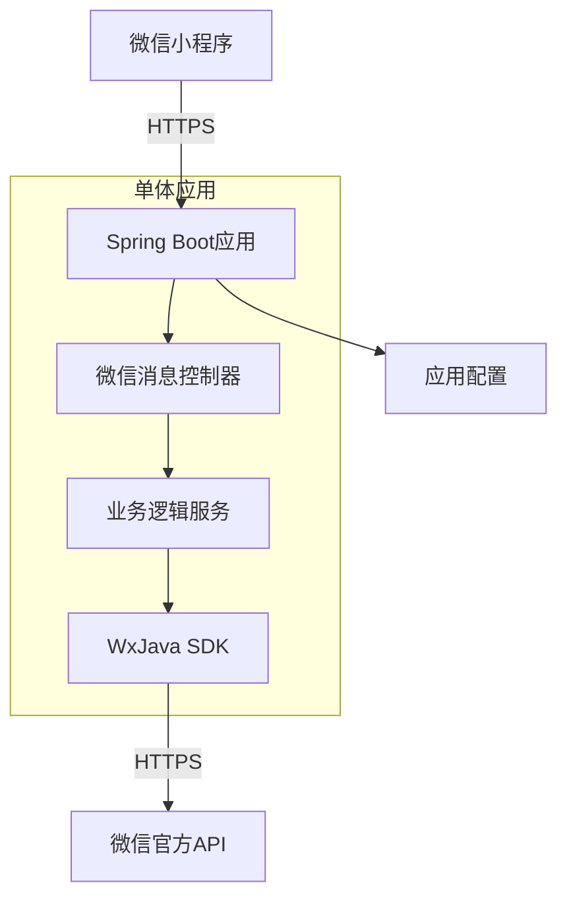

# 系统架构

## 系统概览

本节概述了微信小程序 Java 后端演示项目的核心功能、业务领域和架构模式。

* **项目核心功能与业务领域：**
    * 该项目是一个微信小程序的后端服务实现，主要功能包括：
        * 微信小程序服务端 API 对接
        * 消息服务器配置处理
        * 小程序用户认证和会话管理
    * 业务领域聚焦于微信生态的小程序开发，为小程序提供后端支持服务。

* **架构模式：**
    * **单体应用架构**：基于分析，该项目采用传统的单体应用架构模式。

* **架构模式支撑依据：**
    * 项目使用单一 Docker 容器部署，Dockerfile 构建的是一个包含所有功能的单体 JAR 包
    * 项目结构中没有出现微服务特有的目录结构（如 services/或独立的服务模块）
    * 配置文件中没有多服务协调或服务发现的配置项
    * 使用 Spring Boot 框架，这是典型的单体应用技术选择
    * 所有功能都打包在一个可执行 JAR 中，通过单一入口点启动

## 核心组件与功能图谱

本节详细描述了系统的主要组件及其在架构中的职责和实现方式。

* **流量入口层 (Traffic Entry Layer)：**
    * **组件与职责：**
        * 嵌入式 Tomcat 服务器：作为 HTTP 请求的入口点，处理所有来自微信小程序和微信服务器的请求
        * 可能存在的 API 网关（未明确配置）：考虑到微信生态的特殊性，可能直接在应用内实现微信特定的路由逻辑
    * **实现考量：**
        * Spring Boot 内嵌的 Tomcat 服务器直接暴露 HTTP 端口
        * 微信小程序通信使用 HTTPS 协议
        * 消息服务器验证和 API 路由由应用自身处理

* **应用服务层 (Application Service Layer)：**
    * **服务清单与核心功能：**
        * 微信小程序服务：
            * **主要职责：**
                * 处理微信服务器推送的消息和事件
                * 实现微信小程序 API 的服务端逻辑
                * 管理小程序会话和用户认证
            * **技术基座：**
                * Java 8
                * Spring Boot 框架
                * WxJava 微信开发 SDK
            * **内部结构洞察：**
                * 基于 Spring Boot 的典型分层结构：
                    * Controller 层处理 HTTP 请求
                    * Service 层实现业务逻辑
                    * 使用 WxJava SDK 与微信 API 交互
        * 配置管理服务：
            * 管理微信小程序的各种配置参数（appid, secret, token 等）

* **数据管理层 (Data Management Layer)：**
    * **数据存储组件识别与职责：**
        * 基于当前信息，项目似乎没有显式配置外部数据库
        * 可能使用内存存储或简单的文件存储来管理会话和配置数据
        * 微信用户数据可能直接缓存在内存中或通过微信提供的接口实时获取
    * **数据职责与选型考量：**
        * 由于是小程序演示项目，可能故意简化了数据持久化层
        * 实际生产环境可能会添加 MySQL 或 Redis 来存储用户数据和会话信息

## 容器配置概览

本节列出了通过分析部署文件识别到的容器化服务配置。

| 服务名称 | 容器镜像 | 暴露端口 | 挂载卷 | 关键环境变量 | 启动命令/入口点 |
| :------ | :------ | :------ | :----- | :---------- | :------------- |
| 主应用服务 | 基于 openjdk:8-jdk-alpine 构建 | 未明确指定（通常为8080） | /tmp | 通过JVM参数配置 | java -jar /app.jar |

## 服务间协作与数据流转

本节描述了系统内部组件和外部系统之间的数据流动和交互模式。

* **核心通信路径：**
    1. 微信小程序客户端发起 HTTPS 请求到后端服务
    2. Spring Boot 应用接收请求并通过 Controller 分发
    3. 业务逻辑处理层调用 WxJava SDK 与微信服务器交互
    4. 返回处理结果给小程序客户端

* **交互模式与协议：**
    * 与微信服务器的交互使用 HTTPS 协议
    * 遵循微信小程序开发文档定义的 API 规范
    * 同步请求-响应模式为主

* **共享与隔离：**
    * 作为单体应用，所有组件共享同一个运行时环境
    * 配置参数通过 application.yml 集中管理
    * 没有显式的服务间通信机制

## 整体架构概览图 (Mermaid 语法)

## 架构师核心洞察与未来展望

本节深入分析了架构的关键考量点和未来可能的演进方向。

* **弹性与扩展性策略：**
    * 当前架构作为演示项目，扩展性考虑较少
    * 生产环境可通过多实例部署和负载均衡来扩展
    * 无状态设计便于水平扩展

* **高可用性与韧性设计：**
    * 需要添加健康检查机制
    * 考虑微信接口的容错和重试策略
    * 生产环境需要部署多个实例

* **安全防御体系：**
    * 微信通信本身使用 HTTPS 保障传输安全
    * 需要妥善保管 appid 和 secret 等敏感信息
    * 建议添加请求签名验证

* **运维可观测性与自动化：**
    * 当前配置了基本的日志级别控制
    * 生产环境需要添加监控和告警
    * 使用 CI/CD 流程（如 Travis CI）实现自动化构建

* **性能优化潜力：**
    * 添加 Redis 缓存微信 access_token
    * 优化与微信服务器的交互频率
    * 考虑异步处理耗时操作

* **技术栈合理性评估：**
    * Java + Spring Boot 适合企业级开发
    * WxJava SDK 封装了微信接口，提高开发效率
    * 技术选型成熟稳定

* **未来演进路径与技术引入：**
    * 添加用户数据持久化层（MySQL）
    * 引入 Redis 缓存提升性能
    * 考虑拆分为微服务架构以支持更复杂业务
    * 添加消息队列处理异步任务
    * 实现更完善的监控和运维体系

