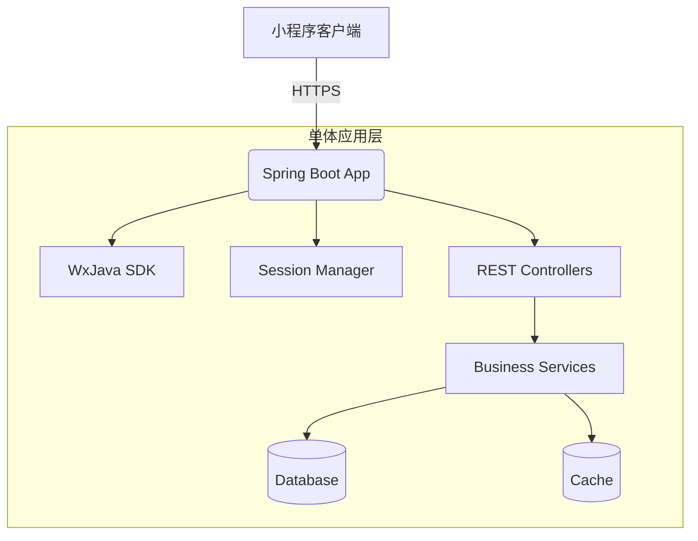

# 系统架构

## 系统概览

该项目是一个用于演示和支撑微信小程序后端服务的 Java 应用程序，主要用于对接微信官方 SDK 并处理来自微信平台的消息推送、用户授权、支付回调等典型业务场景。它服务于移动互联网领域中常见的轻量级后端服务角色，为前端微信小程序提供 API 支撑。

### 项目核心功能与业务领域：

- 微信小程序接入支持：包括登录验证、消息接收、模板消息发送等功能。
- 用户会话管理及凭证校验。
- 对接微信开放接口（如获取用户信息、二维码生成、支付通知解析）。
- 可能延伸至订单管理、活动参与、积分系统等小程序常见业务模块。

### 架构模式：

**单体应用架构（Monolithic Architecture）**

### 架构模式支撑依据：

- 仅存在一个主应用服务容器定义 (`weixin-java-miniapp-demo`)。
- 所有代码集中在一个仓库内，没有发现明显的微服务拆分目录结构（如 `services/user`, `services/order` 等）。
- 技术栈统一为 Spring Boot + Java 生态。
- 缺乏跨服务通信机制的相关配置或线索（如 gRPC、Kafka、RabbitMQ）。
- Dockerfile 显示单一 JAR 包构建镜像并启动整个应用程序。

---

## 核心组件与功能图谱

### 流量入口层 (Traffic Entry Layer)

#### 组件与职责：

由于未显式配置 Nginx 或 API Gateway 相关内容，在默认情况下，该单体应用直接暴露 HTTP(S) 端口供外部调用。其入口点即为核心 Spring Boot 应用本身监听的 Web Server（通常是嵌入式 Tomcat）。

在生产环境中通常建议前置反向代理（如 Nginx）负责 SSL 卸载、静态资源托管、限流熔断等边缘功能。

#### 实现考量：

- 在本地开发或测试阶段，可直接通过主机 IP 加指定端口访问；
- 若需部署上线，则应考虑加入 API 网关层来增强安全性、可观测性和治理能力。

### 应用服务层 (Application Service Layer)

#### 服务清单与核心功能：

##### 主服务：weixin-java-miniapp-demo

- **主要职责：**
  - 处理微信小程序授权登录、session 管理。
  - 解析微信推送的各种消息（文本、图片、事件）。
  - 提供对外 RESTful 接口供小程序客户端调用。
  - 实现微信支付结果回调处理逻辑。
  - 封装了 WxJava SDK 的使用方式以简化开发者工作。

- **技术基座：**
  - 编程语言：Java 8
  - 主框架：Spring Boot
  - 第三方 SDK：WxJava（微信 SDK）
  - 日志框架：SLF4J + Logback（隐含于 Spring Boot 默认）

- **内部结构洞察：**
  - 从命名空间 `com.github.binarywang.demo.wx.miniapp` 推断，项目采用了标准 Maven 包结构：
    - 控制器（Controller）处理 HTTP 请求；
    - 服务层（Service）封装具体业务逻辑；
    - 配置类（Config）初始化 WxMaService 和相关 Bean；
    - DTO 类型对象用于参数绑定与返回值序列化。

#### 异步任务与后台处理：

目前未见明确异步任务组件（如 RabbitMQ/Celery/Kafka 消费者）的相关配置。但考虑到实际应用场景，如下功能可能涉及异步处理需求：

- 微信模板消息批量发送；
- 支付成功后的后续业务操作（积分发放、库存更新）；
- 定期清理过期 session 数据；

这类操作理论上可通过集成 Quartz/Spring Task Scheduling 或引入轻量级消息中间件进行解耦。

### 数据管理层 (Data Management Layer)

#### 数据存储组件识别与职责：

尽管未看到数据库连接字符串或实体映射配置文件，但在典型的微信小程序后端实践中，可能会涉及以下数据存储需求：

- **持久化数据库（如 MySQL/PostgreSQL）：**
  - 存储用户资料、登录凭证、订单记录等核心业务数据。
- **内存缓存（如 Redis）：**
  - 缓存微信 access_token、session_key 等时效性强的数据；
  - 临时存储用户状态或防重幂等控制字段。
- **日志系统（如 ELK Stack）：**
  - 收集运行日志便于排查问题。

#### 数据职责与选型考量：

虽然未给出明确配置，但从 Spring Boot 的生态来看，极有可能采用如下策略：

- 使用 MyBatis/JPA ORM 工具连接关系型数据库；
- Redis 作为高频热点数据的缓存媒介；
- 若无特殊要求，默认选用 MySQL 或 PostgreSQL 作为主数据库，兼顾事务支持与成熟度。

---

## 容器配置概览

| 服务名称 (Service Name) | 容器镜像 (Container Image)     | 暴露端口 (Exposed Ports) | 挂载卷 (Volumes) | 关键环境变量 (Key Env Vars) | 启动命令/入口点 (Startup Command/Entrypoint)           |
| :---------------------- | :----------------------------- | :----------------------- | :--------------- | :-------------------------- | :----------------------------------------------------- |
| `miniapp-backend`       | `openjdk:8-jdk-alpine`         | N/A（默认8080）          | `/tmp`           | N/A                         | `["java", "-Djava.security.egd=file:/dev/./urandom", "-jar", "/app.jar"]` |

> 注：此处为基于 Dockerfile 内容推导出的服务名称及配置，真实部署中应配合 docker-compose.yml 设置网络、端口映射等内容。

---

## 服务间协作与数据流转

本项目为单体架构，不存在传统意义上的“服务间通信”。所有的业务流程都在同一个进程中完成，由 Spring MVC 控制器路由到对应的服务方法执行。

然而，若将来演进为微服务架构，可以预期如下交互模式：

- 前端小程序发起 HTTP 请求 → 主控服务解析路由 → 调用对应的业务 Service 方法；
- Service 层可能调用数据库（JDBC/Hibernate）、Redis（Lettuce/Jedis）或其他第三方 API；
- 特殊场景下触发异步任务投递至消息队列（如 RabbitMQ/Kafka），再由 Worker 进程消费处理。

当前状态下，所有组件共享同一进程内的 JVM 上下文和类加载器，因此也意味着全局共享库（如有 libs/ 目录）会被所有模块引用。

---

## 整体架构概览图 (Mermaid 语法)

---

## 架构师核心洞察与未来展望

### 弹性与扩展性策略：

- 当前架构为单体部署模型，不具备天然横向扩展能力。
- 如需应对高并发请求，可在负载均衡器之后部署多个副本实例，并确保应用无状态化以便调度。
- 数据库可通过读写分离、垂直/水平分片提升吞吐能力。

### 高可用性与韧性设计：

- 单节点部署风险较高，建议引入 Kubernetes 或 ECS 自动重启失败 Pod；
- Redis 缓存宜开启主从复制机制防止宕机影响；
- 数据库应定期备份，并启用 WAL 日志保障崩溃恢复能力。

### 安全防御体系：

- 应强制启用 HTTPS 并使用 Let's Encrypt 等免费证书；
- 敏感密钥不应硬编码在 application.yml 中，而应借助 Vault、AWS Secrets Manager 等工具动态注入；
- 所有来自微信的消息需做签名校验以防伪造攻击。

### 运维可观测性与自动化：

- 应整合 Prometheus + Grafana 实现实时监控；
- 日志应输出为 JSON 格式并通过 Filebeat 发送至 ELK；
- CI/CD Pipeline 可利用 GitHub Actions / Jenkins 自动打包镜像并推送至私有 Registry。

### 性能优化潜力：

- Access Token 应缓存并在失效前提前刷新；
- 频繁访问的小程序用户数据可预热进 Redis；
- 长时间运行的任务应剥离主线程交予后台线程池处理。

### 技术栈合理性评估：

- Java + Spring Boot 是企业级后端开发的经典组合，稳定性强；
- WxJava 提供良好的抽象能力，降低对接复杂度；
- 若团队成员偏向 Node.js 或 Go，则存在重构可能性。

### 数据一致性策略（若适用）：

- 当前架构属于单体事务范畴，ACID 特性自然保证；
- 若后续拆分为多服务，则需要引入分布式事务协调机制（如 Seata、TCC、Saga）。

### 未来演进路径与技术引入：

- 初期维持单体结构有利于快速迭代上线；
- 随着功能增多逐步按领域划分服务，迁移至微服务架构；
- 引入 OpenTelemetry 提升链路追踪能力；
- 探索 Serverless 函数计算替代部分简单接口；
- 结合 AI/ML 能力拓展智能推荐、行为预测等功能模块。

