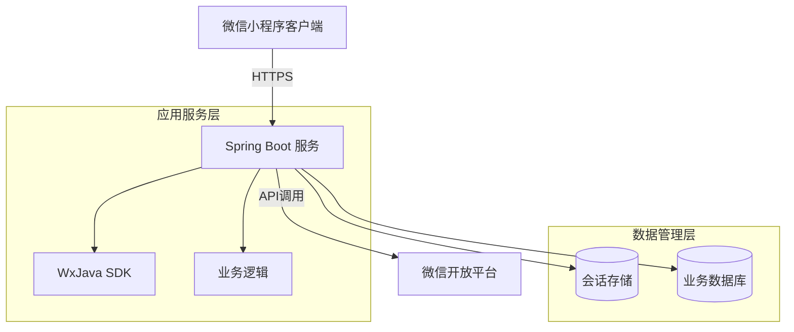

# 系统架构

## 系统概览

本节概述了微信小程序 Java 后端项目的核心功能、业务领域和架构模式。

* **项目核心功能与业务领域：**
    * 该项目是一个微信小程序的后端服务，主要功能包括：
        * 微信小程序 API 对接（消息服务器配置、用户认证等）
        * 小程序业务逻辑处理
        * 微信支付集成（根据 FUNDING.yml 推断）
    * 业务领域属于移动应用后端服务，专注于微信生态集成

* **架构模式：**
    * **单体应用架构**（Monolithic Architecture）
    
* **架构模式支撑依据：**
    * 单一 Dockerfile 构建一个完整的可执行 JAR 包
    * 使用 Spring Boot 框架（从 application.yml 中的配置推断）
    * 没有微服务特有的目录结构（如 services/）或服务间通信机制
    * 项目通过 Maven 进行单体构建（.travis.yml 中的 mvn clean package）
    * 所有功能打包在单个 JAR 文件中（weixin-java-miniapp-demo-1.0.0-SNAPSHOT.jar）

## 核心组件与功能图谱

本节详细描述了系统的主要组件及其职责。

* **流量入口层 (Traffic Entry Layer)：**
    * **组件与职责：**
        * 微信小程序客户端直接通过 HTTPS 与后端服务通信
        * 可能存在的 API 网关（未明确配置，但微信生态通常直接对接后端）
    * **实现考量：**
        * 直接暴露 Spring Boot 内嵌容器（Tomcat/Netty）
        * 生产环境可能前置 Nginx 进行负载均衡和 SSL 终止

* **应用服务层 (Application Service Layer)：**
    * **服务清单与核心功能：**
        * **微信小程序集成服务**：
            * **主要职责**：处理微信小程序 API 请求，包括：
                - 消息服务器验证和消息处理
                - 用户登录认证（code2session）
                - 小程序业务逻辑
            * **技术基座**：
                - Java 8
                - Spring Boot 框架
                - WxJava 微信开发 SDK
            * **内部结构洞察**：
                - 基于 Spring Boot 的标准分层：
                    * Controller 层处理 HTTP 请求
                    * Service 层实现业务逻辑
                    * 集成 WxJava SDK 处理微信特定协议

* **数据管理层 (Data Management Layer)：**
    * **数据存储组件识别与职责：**
        * 未明确配置数据库，但微信小程序后端通常需要：
            - 用户会话存储（可能使用 Redis）
            - 业务数据存储（可能使用 MySQL 或 MongoDB）
        * 从配置推断可能使用内存数据库（H2）或外部数据库
    * **数据职责与选型考量：**
        * 微信会话信息需要高速存取（适合 Redis）
        * 业务数据需要持久化（适合关系型数据库）

## 容器配置概览

本节列出了容器化部署的关键配置信息。

| 服务名称 | 容器镜像 | 暴露端口 | 挂载卷 | 关键环境变量 | 启动命令/入口点 |
|----------|----------|----------|--------|--------------|-----------------|
| 微信小程序服务 | 基于 openjdk:8-jdk-alpine 构建 | 未明确指定 | /tmp 临时卷 | 通过 JVM 参数配置安全随机数源 | java -jar /app.jar |

## 服务间协作与数据流转

本节描述了系统内外的数据流动和交互模式。

* **核心通信路径：**
    * 微信小程序客户端 → HTTPS → 后端服务
    * 后端服务 → 微信开放平台 API（如获取用户信息）

* **交互模式与协议：**
    * 同步 RESTful API（微信小程序与后端）
    * 可能使用 Redis 进行会话缓存（推断）

* **共享与隔离：**
    * 单体架构共享所有数据存储
    * 配置通过 Spring Boot 的 application.yml 集中管理

## 整体架构概览图

## 架构师核心洞察与未来展望

本节分析了架构的关键考量点和未来发展方向。

* **弹性与扩展性策略：**
    * 可通过多实例部署实现水平扩展
    * 建议将会话状态外部化（Redis）以实现无状态

* **高可用性与韧性设计：**
    * 需要数据库集群保障数据可靠性
    * 建议实现健康检查和自动恢复

* **安全防御体系：**
    * 必须正确配置微信消息加密（aesKey）
    * 需要保护敏感配置（secret/token）
    * 建议实现请求签名验证

* **运维可观测性与自动化：**
    * 已配置分层日志（application.yml）
    * 需要补充指标监控和告警

* **性能优化潜力：**
    * 微信 API 调用可考虑缓存
    * 数据库查询需要优化

* **技术栈合理性评估：**
    * Java 8 已较旧，建议升级到 LTS 版本
    * Spring Boot + WxJava 组合适合微信生态

* **未来演进路径：**
    * 可考虑拆分为微服务（如独立支付服务）
    * 增加消息队列处理异步任务
    * 引入服务网格增强通信可靠性

