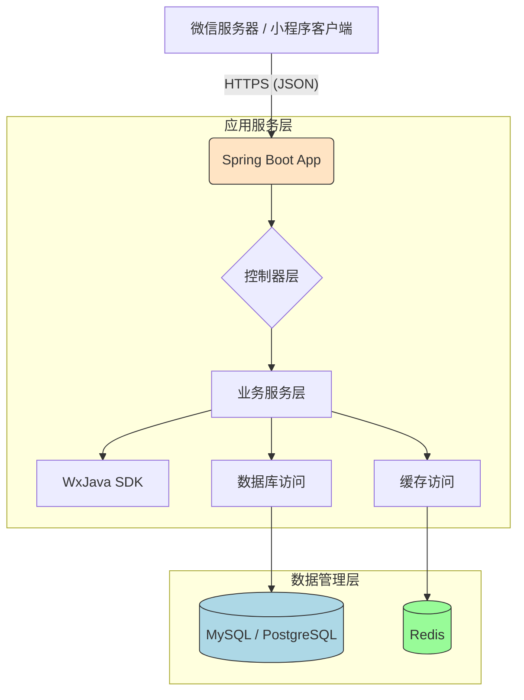

# 系统架构

## 系统概览

本节对整个后端项目的宏观定位、核心功能及所采用的架构模式进行了系统性归纳与判断，为后续详细分析提供了基础视角。

* **项目核心功能与业务领域：**  
  此项目是一个面向微信小程序平台的服务端实现示例，主要用于演示如何通过 Java 技术栈对接并处理来自微信小程序的消息推送、用户授权登录、支付回调等功能。其核心业务领域聚焦于微信生态内的轻量级服务接入与交互管理。

* **架构模式：**  
  **单体应用（Monolithic Architecture）**

* **架构模式支撑依据：**  
  - 所有服务代码集中在一个仓库中，无明显 `services/` 或 `modules/` 等多服务拆分结构；
  - 只存在一个 `Dockerfile` 文件，位于 `/src/main/docker/Dockerfile`，表明打包部署单元单一；
  - 应用配置文件仅包含一个统一的 Spring Boot 配置文件 (`application.yml.template`)；
  - 项目使用 Maven 构建工具进行整体编译和打包；
  - 没有发现多个独立的依赖管理文件（如多个 `pom.xml` 或 `package.json`），也未见服务间通信机制的相关线索（如 gRPC 定义、Kafka 消费者等）；
  - `.travis.yml` 中定义了单一构建脚本 `"mvn clean package"`，进一步印证其单体特性。

---

## 核心组件与功能图谱

本节围绕系统三大逻辑层级展开，逐层剖析各组件的功能职责和技术选型，并结合上下文推测潜在的数据处理流程和服务形态。

* **流量入口层 (Traffic Entry Layer)：**
    * **组件与职责：**  
      当前项目并未显式暴露前端反向代理或网关类组件（如 Nginx、Traefik、Zuul）。但在生产环境中，通常会借助此类组件完成 SSL 终止、路由转发、限流熔断等职能。由于缺乏直接配置信息，该层暂视为外部网络与后端服务之间的抽象边界。
    
    * **实现考量：**  
      在实际部署时，可通过 Kubernetes Ingress Controller、API Gateway（如 Kong、AWS API Gateway）或传统负载均衡器（如 HAProxy/Nginx）实现对外暴露。

* **应用服务层 (Application Service Layer)：**
    * **服务清单与核心功能：**
        * **主要职责：**  
          处理微信小程序发来的各类请求，包括但不限于：
          - 用户身份验证与会话维护；
          - 微信消息接收与响应；
          - 支付通知解析与业务联动；
          - 小程序接口封装与调用（如获取用户信息、模板消息发送）；
        
        * **技术基座：**  
          - 编程语言：Java 8
          - 主框架：Spring Boot
          - SDK 依赖：WxJava（用于简化微信开放平台相关接口开发）
          - 构建工具：Maven
        
        * **内部结构洞察：**  
          虽然没有完整的源码目录树，但从标准 Spring Boot 工程结构可推断其大致分为如下模块：
          - `controller/api`: 对接 HTTP 请求的入口控制器；
          - `service/domain`: 实现具体业务逻辑；
          - `config`: 配置类加载与 Bean 初始化；
          - `dto/model`: 数据传输对象与实体映射；
          - `handler`: 特定类型事件处理器（如微信消息监听）；

    * **异步任务与后台处理：**  
      当前未观察到显式的异步任务调度框架（如 Quartz、Celery、Sidekiq）或消息中间件集成（如 RabbitMQ/Kafka）。然而，在涉及耗时操作（如支付确认后的异步通知、批量消息推送）场景下，推荐引入轻量级任务队列支持（如 Redis-based Queue + Worker Thread Pool），以提升主服务吞吐能力和稳定性。

* **数据管理层 (Data Management Layer)：**
    * **数据存储组件识别与职责：**  
      目前尚未提供任何关于数据库、缓存或消息队列的实际配置文件或连接字符串。因此基于 Spring Boot 生态常见实践作出以下合理假设：

        | 组件       | 类型     | 用途说明                                   |
        |------------|----------|--------------------------------------------|
        | MySQL / PostgreSQL | RDBMS   | 存储用户账户信息、订单记录、业务元数据等持久化数据 |
        | Redis      | 内存缓存 | 用于 Session 管理、Token 缓存、热点数据加速 |
        | Kafka/RabbitMQ | 消息队列 | 若需解耦异步事件流，可用于异步消息投递 |

    * **数据职责与选型考量：**  
      - RDBMS：适合结构化数据强一致性要求高的场景（如用户资料、交易明细）；
      - Redis：提高高频访问效率，尤其适用于 OAuth Token 生命周期管理和临时状态缓存；
      - MQ：增强系统松耦合能力，便于扩展异步消费链路（如日志采集、审计跟踪）。

---

## 容器配置概览

本节汇总了目前可见的所有容器化服务及其关键参数设置，反映部署阶段的技术选型与资源配置意图。

| 服务名称 (Service Name) | 容器镜像 (Container Image) | 暴露端口 (Exposed Ports) | 挂载卷 (Volumes) | 关键环境变量 (Key Env Vars) | 启动命令/入口点 (Startup Command/Entrypoint) |
| :---------------------- | :-------------------------- | :----------------------- | :--------------- | :-------------------------- | :------------------------------------------- |
| app                     | openjdk:8-jdk-alpine        | 默认不暴露               | `/tmp`           | 无显式声明                  | `["java", "-Djava.security.egd=file:/dev/./urandom", "-jar", "/app.jar"]` |

> 注：虽然未看到 docker-compose.yml，但从 Travis CI 构建行为可以确定最终产物是一个 fat jar 并被打包进 Alpine Linux 基础镜像内运行。

---

## 服务间协作与数据流转

本节揭示了系统内外部之间典型的数据交互路径、通信协议以及资源共享情况。

* **核心通信路径：**  
  - 外部客户端（微信服务器） → Spring Boot 应用（REST API 接口）→ 数据库 / 缓存 / 第三方微信 API；
  - 用户认证流程：小程序发起 OAuth 登录请求 → 后端换取 session_key & openid → 返回自定义 token 给前端；
  - 支付回调流程：微信支付中心异步 POST 回调 URL → 控制器处理支付结果 → 更新本地订单状态 → 触发后续动作（如发货通知）；

* **交互模式与协议：**
    - 协议层面：主要依赖 HTTP(S)，适配 RESTful 设计风格；
    - 交互机制：同步请求-响应为主，部分场景辅以定时轮询或 webhook 回调机制；
    - 与微信平台：调用微信官方提供的 Open API（HTTPS JSON 格式交互）；

* **共享与隔离：**
    - 当前属于单体架构，不存在跨服务调用问题；
    - 若未来演变为微服务，建议每个子域（如 auth、payment、user）独立数据库 schema 或物理分库，防止紧耦合风险；
    - 共享库（如 WxJava SDK）宜统一版本控制并通过 Maven Dependency 管理注入各服务工程中。

---

## 整体架构概览图 (Mermaid 语法)

---

## 架构师核心洞察与未来展望

本节从全局视角出发，深入剖析当前架构的优势、挑战及发展方向，助力团队制定长期演进策略。

* **弹性与扩展性策略：**  
  当前单体架构易于初期快速交付，但随业务增长可能出现瓶颈。建议逐步实施以下措施：
  - 应用无状态化改造，方便横向扩容；
  - 引入外部负载均衡器（如 ALB/NLB）实现流量分发；
  - 使用 Kubernetes Deployment 控制副本数动态调节；
  - 对热点接口启用二级缓存（Local Cache + Remote Cache）减少 DB 压力；

* **高可用性与韧性设计：**  
  - 部署至少两个实例以规避单点故障；
  - Redis/MongoDB 等组件开启主从复制机制；
  - 利用 Spring Retry/Hystrix 实现容错保护；
  - 日志集中收集（ELK Stack）+ 健康检查探针提升可观测性；

* **安全防御体系：**  
  - 所有 API 必须启用 HTTPS 加密传输；
  - 接口权限校验应结合 JWT/OAuth2；
  - 微信敏感字段（secret/aesKey）不应硬编码至代码库，需通过环境变量或 Vault 密钥管理系统注入；
  - 设置严格的 CORS 白名单与输入校验规则防范 XSS/XSRF 攻击；

* **运维可观测性与自动化：**  
  - 引入 Prometheus + Grafana 监控 JVM 性能指标；
  - Jenkins/GitLab CI 自动触发构建与灰度发布；
  - Logback 输出结构化日志，便于 Splunk/Elasticsearch 解析追踪；

* **性能优化潜力：**  
  - 查询 SQL 加索引优化；
  - 使用 Redis Pipeline 减少 RTT 开销；
  - 合理利用 HTTP Keep-Alive 提升长连接复用率；
  - 对频繁变更的小对象考虑序列化压缩策略；

* **技术栈合理性评估：**  
  - Java + Spring Boot 成熟稳定，社区活跃，适用于企业级微信后端开发；
  - WxJava 封装良好，极大降低微信对接成本；
  - 建议升级 JDK 至 LTS 版本（如 17）以便享受新特性红利；

* **数据一致性策略（若适用）：**  
  - 单体架构下事务可控性强，可借助 @Transactional 注解保障本地 ACID；
  - 如后期拆分为多服务，则需要引入 Saga 模式或 Event Sourcing 方案协调分布式事务；

* **未来演进路径与技术引入：**  
  - 随着业务复杂度上升，可探索将用户中心、订单中心、支付中心分别拆成独立微服务；
  - 引入 Istio 服务网格强化治理能力（流量控制、熔断降级）；
  - 结合 Serverless Function（如 AWS Lambda）处理低频突发任务（如报表生成）；
  - 引入 AI/ML 模块辅助数据分析（如用户画像预测、营销活动效果评估）。

